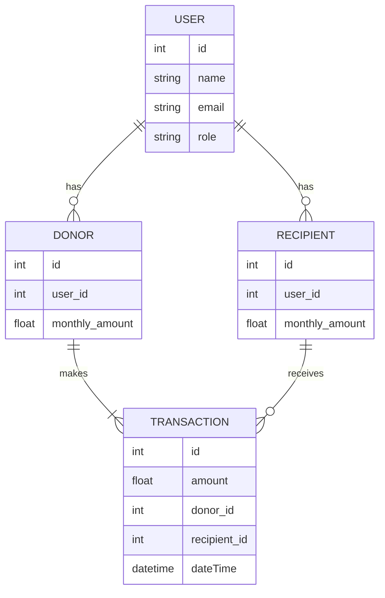

# Charity Tracker

Problem Statement: We want to track charity. The money comes into one account from different donors at regular intervals (some monthly) and goes out to multiple accounts on a monthly basis.

At the start of each month, we want to reset the different donors and once a donation is received, we want to mark it as received. Similarly, once the donation is send to a receiver, we want to mark it as sent.

Database Schema:

User:

- id
- name
- email
- role (admin, donor, recipient)

Donor:

- id
- user_id
- monthly_amount

Recipient:

- id
- user_id
- monthly_amount

Transaction:

- id
- amount (positive for received, negative for sent)
- donor_id
- recipient_id
- dateTime

